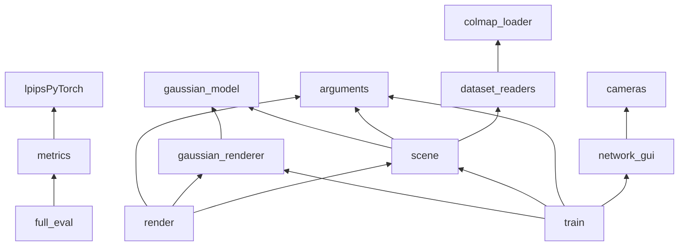

# [â—](./README.md) Dependency - Original Reference

- The curcial modules are: `arguments` and `gaussian_renderer`
- The feature modules are: `render` and `train`

```mermaid
flowchart BT
  gaussian_renderer --> gaussian_model
  metrics --> lpipsPyTorch
  full_eval --> metrics
  dataset_readers --> colmap_loader
  render --> arguments
  render --> gaussian_renderer
  render --> scene
  train --> gaussian_renderer
  train --> scene
  train --> arguments
  train --> network_gui
  network_gui --> cameras
  scene --> gaussian_model
  scene --> arguments
  scene --> dataset_readers
```
