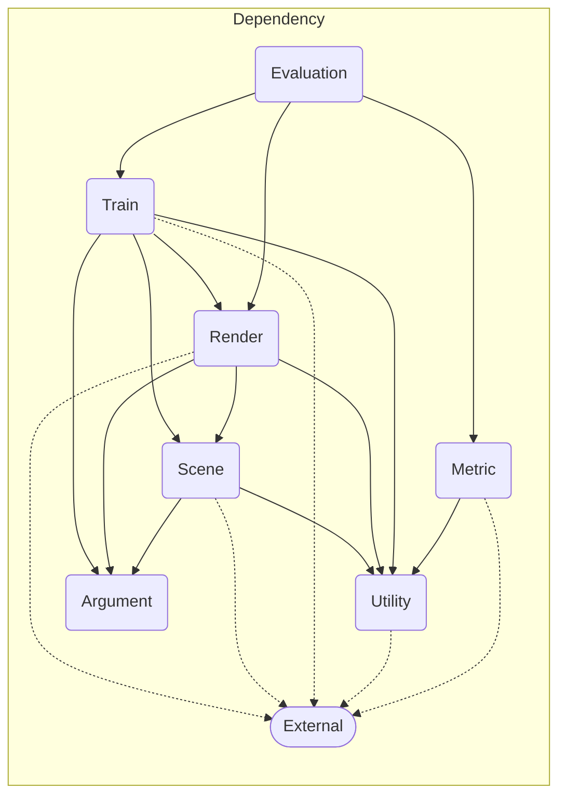
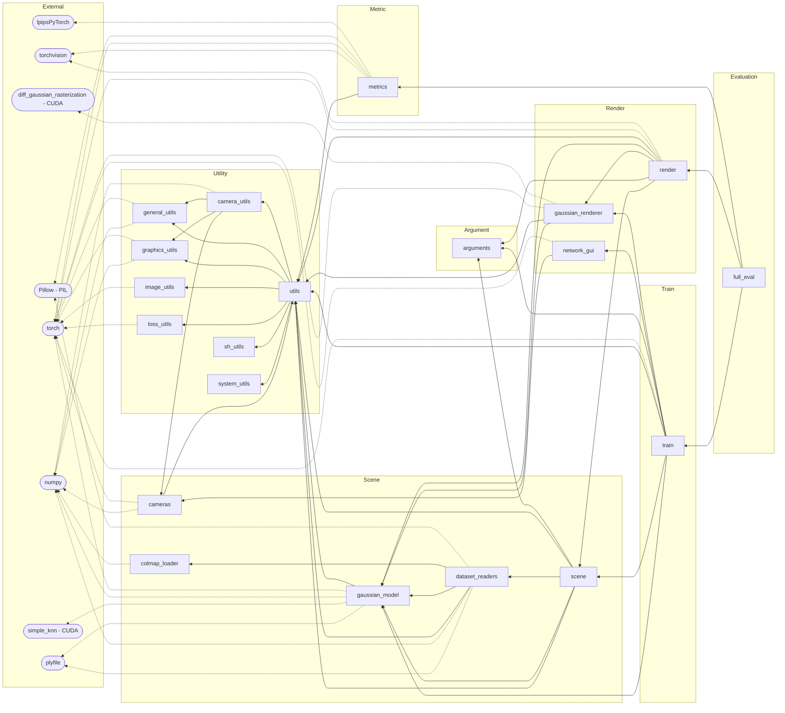

# [⎗](./README.md) Dependency - Original Reference

## Overview

- The modules can be categorized into the following groups:
  - External
  - Utility
  - Argument
  - Scene
  - Metric
  - Render
  - Train
  - Evaluation

## Simplified Dependency Graph

## Detailed Dependency Graph

