# [⎗](./README.md) Implementation - Original Reference

## Contents

- [External Dependencies](#external-dependencies)
- [Torch](#torch)
- [GPU Programming](#gpu-programming)
- [Torch Extension](#torch-extension)

## External Dependencies

The following external dependencies are required to fully evaluate the project:

- diff_gaussian_rasterization
- lpipsPyTorch
- numpy
- Pillow
- plyfile
- simple_knn
- torch
- torchvision

## Torch

The project heavily relies on PyTorch and its ecosystem.

## GPU Programming

Some parts of the training process of 3D Gaussians is written in CUDA C++ to make use of NVIDIA GPU's parallelized computation.

## Torch Extension

The project uses a custom PyTorch extension to accelerate the computation of Gaussian splatting. Specifically, it uses `diff_gaussian_rasterization` to render Gaussian splats and `simple_knn` to initialize from Point Cloud data.

### Call Tree in Python modules

1. All items from `diff_gaussian_rasterization`

2. All items from `simple_knn`

