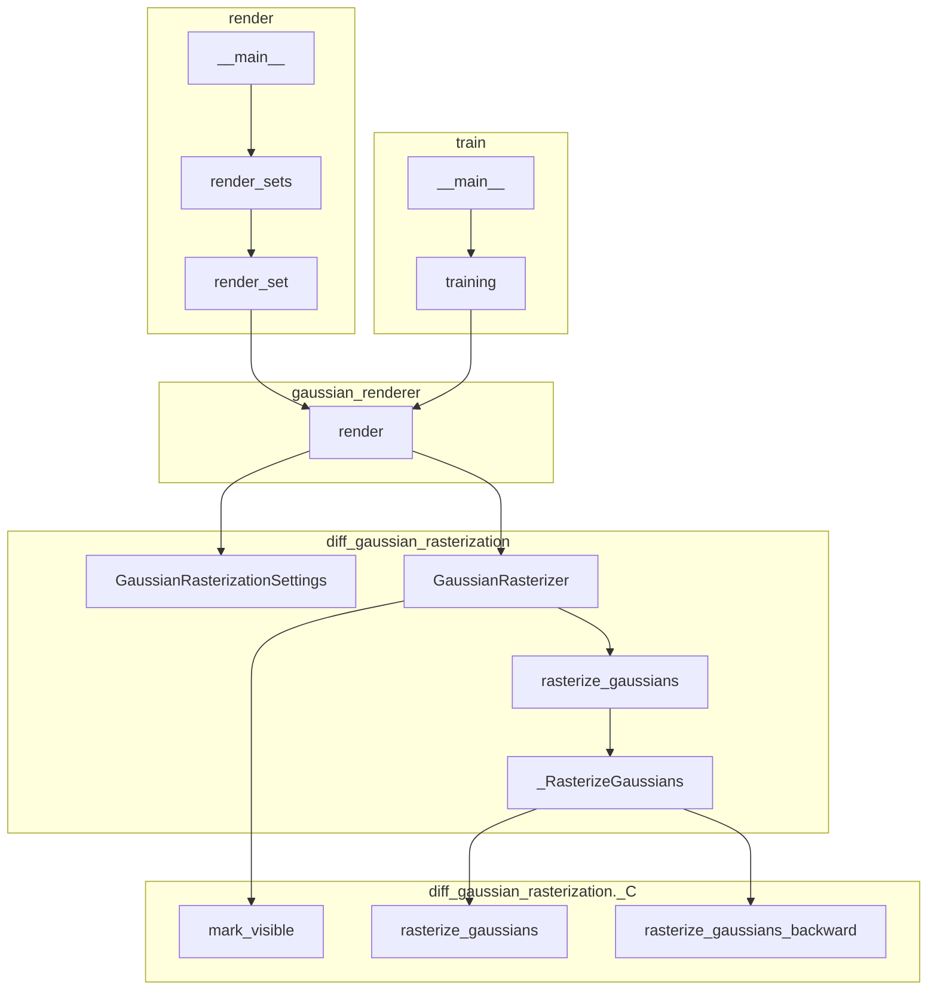
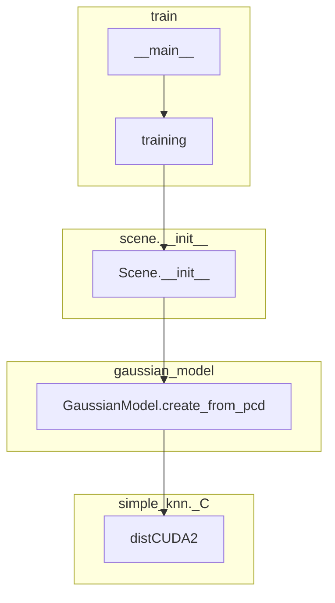
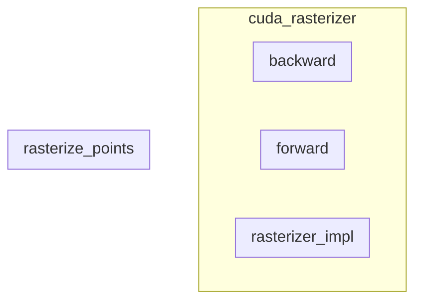

# [⎗](./README.md) Procedure - Original Reference

## What components does it consist of?

Let's see [the description](https://github.com/graphdeco-inria/gaussian-splatting/?tab=readme-ov-file#overview) excerpted from the original manual:

> The codebase has 4 main components:
>
> - A PyTorch-based optimizer to produce a 3D Gaussian model from SfM inputs.
>
> - A network viewer that allows to connect to and visualize the optimization process.
>
> - An OpenGL-based real-time viewer to render trained models in real-time.
>
> - A script to help you turn your own images into optimization-ready SfM data sets.

Let's explain each of them in detail.

## Contents

- [Preprocessing](#preprocessing)
- [Loading](#loading)
- [Training](#training)
- [Evaluation](#evaluation)
- [Rendering](#rendering)
- [Extras](#extras)

## Preprocessing

> A script to help you turn your own images into optimization-ready SfM data sets.

Let's check out their repository. They've [told](https://github.com/graphdeco-inria/gaussian-splatting/?tab=readme-ov-file#processing-your-own-scenes) us to use [`COLMAP`](https://colmap.github.io/) and [`./convert.py`](https://github.com/graphdeco-inria/gaussian-splatting/blob/main/convert.py) to **process your own scenes**.

The repository structure looks like this now:

```plaintext
./
|- convert.py
```

## Loading

After preprocessing and before training, we need to load the data and initialize the model.

Where does loading process happen? Let's check out their modules.

This is the dependency graph of loader modules, where we can see that `colmap_loader` is the base loader:


## Training

## Evaluation

## Rendering

## Extras

### Call Tree in Python modules

1. All items from `diff_gaussian_rasterization`


2. All items from `simple_knn`


---

### Call Tree in CUDA C++ modules

1. All items from `diff_gaussian_rasterization`


2. All items from `simple_knn`

